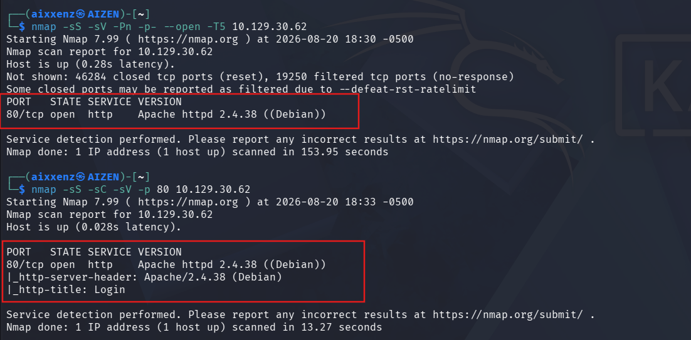
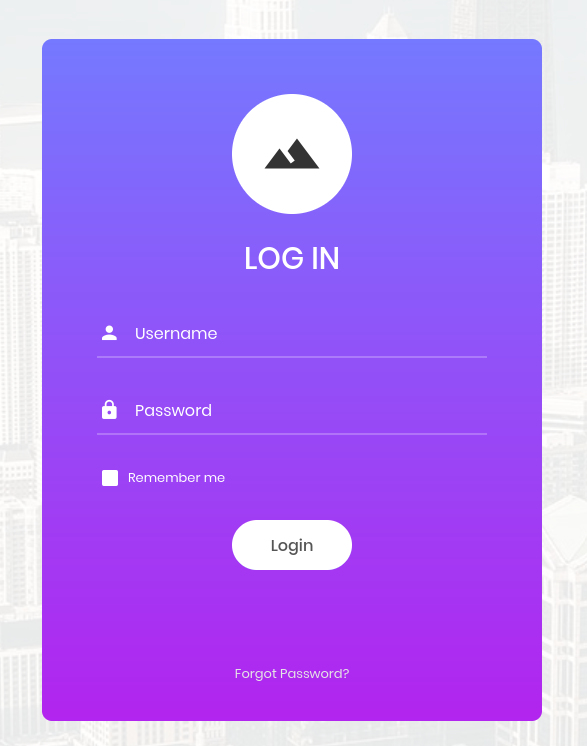
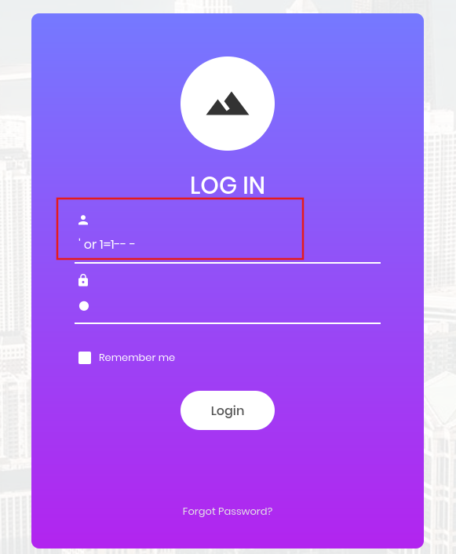

# Appointment
> **Dificultad:** Muy Fácil.

> **IP:** 10.129.30.62 

> **SO:** Linux (Debian).

> **Habilidades puestas a prueba:**
> - Reconocimiento de puertos.
> - Inyección SQL (SQLi).

> **Hallazgos:** Aplicación web vulnerable a Ataques de Inyección SQL (SQLi)

---

# Descripción
Appointment es una máquina Linux muy sencilla que muestra técnicas básicas de SQL Injection frente a una aplicación web habilitada para bases de datos SQL.


---

# Herramientas utilizadas
- `Nmap` - Herramienta de escaneo de red empleada para la identificación de servicios en la máquina objetivo.
- `Navegador Web` - Ingresar a la aplicación web identificada. 
- `Kali Linux` - Distribución utilizada como entorno de trabajo.

---

# Alcance y objetivos
Localizar la Aplicación web y eludir el panel de Login con el objetivo de obtener la Flag.

---

# Escaneo
Se realizaron dos fases de escaneo con Nmap para identificar los puertos expuestos y posteriormente profundizar sobre los servicios detectados:
````bash
nmap -sS -sV -Pn -p- --open -T5 10.129.30.62
````
````bash
nmap -sS -sC -sV -p 80 10.129.30.62
````
# Output
````bash
PORT   STATE SERVICE VERSION
80/tcp open  http    Apache httpd 2.4.38 ((Debian))
|_http-server-header: Apache/2.4.38 (Debian)
|_http-title: Login
````


# Desglose del comando:
1. **`-sS ` (SYN Scan)**: Realiza un escaneo de sigilo (medio abierto) para determinar si el puerto está abierto sin completar el saludo de tres vías (Three-Way Handshake) de TCP.
2. **`-sV` (Version Detection):** Interroga al puerto para identificar la versión exacta del servicio activo.
3. **`-Pn` (No Ping):** Omite la prueba ICMP inicial y asume que el host está activo para evitar que un firewall bloquee el análisis.
4. **`-p-`:** Escanea la totalidad de los 65,536 puertos TCP.
5. **`–open`:** Muestra únicamente los puertos abiertos.
6. **`-T5`:** Aplica una velocidad muy alta para analizar los puertos.
7. **`-sC`:** Ejecuta los scripts básicos de Nse para obtener información del encabezado del servidor web. 
8. **`-p 80`:** Limita el escaneo al servicio http.


---

# Enumeración
Al confirmar la apertura del puerto `80/TCP`, se accedió desde el navegador web a la dirección `http://10.129.30.62:80`.


La aplicación web desplegó un formulario de autenticación con campos para usuario **(Username**) y contraseña **(Password)**.



---
# Explotación
Dado que no se contaban con credenciales válidas, se procedió a evaluar la presencia de vulnerabilidades de Inyección SQL **(SQLi)** en el mecanismo de autenticación para eludir la validación.



# Payload utilizado
En el campo de usuario **(Username)** se ingresó el siguiente vector de prueba:
````bash
' or 1=1-- -
````
# Explicación del Payload
1. **`'`:** Rompe la consulta SQL original del backend en la consulta SELECT * FROM users WHERE username = 'INPUT' ....
2. **`or 1=1`:** Introduce una condición tautológica (siempre verdadera), forzando a la base de datos a retornar una coincidencia válida sin importar el nombre de usuario introducido.
3. **`-- -`:** Comenta el resto de la instrucción SQL original (incluyendo la verificación del campo Password), evitando errores de sintaxis en el motor de base de datos.

---
# Flag
Al enviar el formulario con el payload, la aplicación validó la sesión como exitosa y redirigió a una página que expuso directamente la bandera: 


### Flag : e3d07******************

---

# Lecciones aprendidas y recomendaciones
- **Uso de Consultas Parametrizada (Parameterized Queries):** La consulta SQL no debe concatenar entradas de usuario directamente. Se deben implementar sentencias preparadas para que la base de datos trate la entrada del usuario estrictamente como datos y no como código ejecutable.
- **Sanitización de entradas (Input Sanitization):** Validar y filtrar caracteres especiales (', ", ;, --) antes de procesar solicitudes HTTP en el servidor web.
- **Principio de mínimo privilegio:** Asegurar que la cuenta con la que se conecta la aplicación web a la base de datos solo posea permisos mínimos necesarios de consulta.

---

# Conclusión
El análisis sobre el objetivo permitió identificar una vulnerabilidad crítica de Inyección SQL **(SQLi)** en el panel de inicio de sesión. La falta de parametrización en las consultas hacia la base de datos hizo posible alterar la lógica de autenticación mediante el payload `' or 1=1-- -`, otorgando acceso no autorizado al sistema y permitiendo la exfiltración de la bandera **(flag)**.

