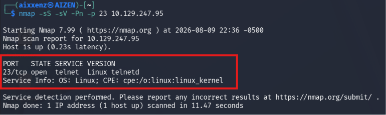
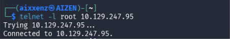
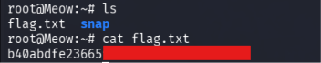

# Meow
> **Dificultad:** Muy Fácil

> **IP:** 10.129.247.95

> **SO:** Linux

> **Habilidades puestas a prueba:**
> - Escaneo
> - Análisis de malas configuraciones en servicios remotos
> - Autenticación nula y pruebas de credenciales
> - Navegación e interacción en consola Linux

> **Hallazgos:** Servicio Telnet expuesto con credenciales predeterminadas

---

# Descripción

**Meow** es una máquina Linux muy sencilla. La máquina se centra en técnicas de enumeración para principiantes y muestra la explotación de un servicio **Telnet** vulnerable mediante credenciales predeterminadas.

---

# Herramientas utilizadas
- `Nmap` - Herramienta de escaneo de red empleada para la identificación de servicios en la máquina objetivo.  
- `Cliente Telnet` - Interacción directa con el puerto **23** para validar el acceso con el usuario `root` sin contraseña.
- `Kali Linux` - Distribución utilizada como entorno de trabajo.

---

# Alcance y objetivos

Explotación del servicio Telnet mal configurado con credenciales predeterminadas

---

# Escaneo

Se realizó un escaneo de puertos hacia la IP objetivo identificando el puerto **23/TCP** abierto, el cual corresponde al servicio **Telnet (Linux Telnetd)**
```bash
nmap -sS -sV -Pn -p 23 10.129.247.95
```
# Output
```bash
PORT STATE SERVICE VERSION
23/tcp open telnet Linux telnetd
```

# Desglose del comando:

  1. ``-sS (SYN Scan):`` Realiza un escaneo de sigilo (medio abierto) para determinar si el puerto está abierto sin completar el saludo de tres vías (Three-Way Handshake) de TCP.
  2. ``-sV (Version Detection):`` Interroga al puerto para identificar la versión exacta del servicio activo.
  3. `-Pn (No Ping):` Omite la prueba ICMP inicial y asume que el host está activo para evitar que un firewall bloquee el análisis.
  4. ``-p 23:`` Restringe el escaneo únicamente al puerto objetivo para optimizar el tiempo de respuesta.

---

# Enumeración

Al interactuar con el servicio Telnet descubierto, se verificó que el sistema acepta la conexión del usuario administrador **root** sin solicitar la contraseña.

```bash
telnet -l root 10.129.247.95
```

# Output
```bash
Trying 10.129.247.95...
Conected to 10.129.247.95.
```


---
# Explotación

Aprovechando la mala configuración de la autenticación del servicio Telnet, se estableció una sesión remota con privilegios de root y se procedió a extraer la bandera **flag.txt**.

```bash
root@Meow:~# ls
flag.txt  snap
root@Meow:~# cat flag.txt
b40abdfe23665***************
````


### Flag: b40abdfe23665***************

---

# Lecciones aprendidas y recomendaciones

- Telnet es un protocolo heredado que transmite credenciales y comandos en texto plano. Debe ser deshabilitado y reemplazado por **SSH**
- Hardening de políticas de contraseñas:
  1. Bloquear el inicio de sesión directo del usuario root a través de servicios de red remotos
  2. Forzar políticas de contraseñas robustas y deshabilitar cuentas con contraseñas vacías o por defecto

---

# Conclusión
El análisis realizado sobre el objetivo permitió identificar que la exposición directa del servicio Telnet, combinada con una política de autenticación nula en la cuenta de administrador **(root)**, representa una vulnerabilidad de impacto crítico. Esta mala configuración permite a un atacante no autenticado tomar control total del sistema de forma inmediata sin necesidad de ejecutar un exploit complejo.


