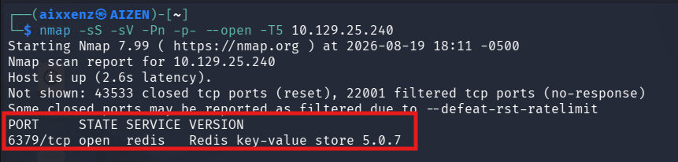
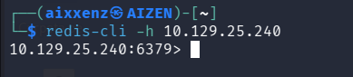
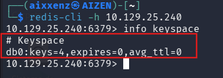
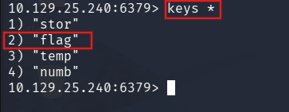
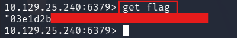

# Redeemer
> **Dificultad:** Muy Fácil

> **IP:** 10.129.25.240

> **SO:** Linux

> **Habilidades puestas a prueba:**
> - Reconocimiento de puertos
> - Navegación e interacción con consola Linux
> - Manejo de la interfaz Redis

> **Hallazgos:** Acceso no autenticado a Redis lo que permite listar las llaves almacenadas.

---

# Descripción
Redeemer es una máquina Linux muy sencilla que explora la enumeración y explotación de un servidor de base de datos Redis mientras muestra la utilidad de línea de comandos redis-cli y comandos básicos para interactuar con el servicio Redis.

---

# Herramientas utilizadas
- `Nmap` - Herramienta de escaneo de red empleada para la identificación de servicios en la máquina objetivo.
- `Redis-cli` - Interacción directa con Redis
- `Kali Linux` - Distribución utilizada como entorno de trabajo.

---

# Alcance y objetivos
Acceder a la base de datos NoSQL del servicio Redis donde se listarán las llaves almacenadas en busca de información de valor

---

# Escaneo
Se realizó un escaneo completo de puertos hacia la IP objetivo con Nmap para identificar servicios expuestos:
````bash
nmap -sS -sV -Pn -p- –open -T5 10.129.25.240
````
# Output
````bash
PORT     STATE SERVICE VERSION
6379/tcp open  redis   Redis key-value store 5.0.7
````


# Desglose del comando:
1. **`-sS` (SYN Scan):** Realiza un escaneo de sigilo (medio abierto) para determinar si el puerto está abierto sin completar el saludo de tres vías (Three-Way Handshake) de TCP.
2. **`-sV` (Version Detection):** Interroga al puerto para identificar la versión exacta del servicio activo.
3. **`-Pn` (No Ping):** Omite la prueba ICMP inicial y asume que el host está activo para evitar que un firewall bloquee el análisis.
4. **`-p-`:** Escanea la totalidad de los 65,536 puertos TCP.
5. **`–open`:** Muestra únicamente los puertos abiertos.
6. **`-T5`:** Aplica una velocidad Muy alta para analizar los puertos.

---

# Enumeración

Al detectar el puerto **6379/TCP** abierto correspondiente a la base de datos NoSQL **Redis (v5.0.7)**, se utilizó el cliente de línea de comandos `redis-cli` para verificar si el servicio requería contraseña:

````bash
redis-cli -h 10.129.25.240
````



El servidor otorgó acceso inmediato sin solicitar autenticación.
A continuación, se ejecutó el comando `info keyspace` dentro de la consola de Redis para consultar las bases de datos activas y la cantidad de llaves almacenadas:

````bash
10.129.25.240:6379> info keyspace
# Keyspace
db0:keys=4,expires=0,avg_ttl=0
````



**Hallazgo:** La base de datos principal **(db0)** cuenta con 4 llaves registradas.

**Nota:** Al confirmar que la base de datos `db0` contenía las 4 llaves registradas, no fue necesario ejecutar el comando de selección `SELECT 0`, ya que al establecer conexión mediante `redis-cli`, el cliente se posiciona de manera predeterminada en la base de datos `db0`.


---
# Explotación
Se utilizó el comando `keys *` para listar el nombre de todas las llaves almacenadas en la base de datos `db0`:

````bash
10.129.25.240:6379> keys *
1) "stor"
2) "flag"
3) "temp"
4) "numb"
````



Al identificar la existencia de la llave **"flag",** se procedió a consultar su valor utilizando la instrucción get:
````bash
10.129.25.240:6379> get flag
"03e1d2b************************"
````



### Flag : 03e1d2b******************

---

# Lecciones aprendidas y recomendaciones

- Habilitar autenticación obligatoria.
- **Vincular el servicio a interfaces locales:** Por defecto, Redis debe escuchar únicamente en la interfaz de bucle invertido **(127.0.0.1)** o en redes privadas autorizadas para evitar su exposición a Internet.

---

# Conclusión
El análisis de la máquina objetivo demostró el peligro de desplegar bases de datos clave-valor sin las configuraciones de seguridad por defecto. La ausencia de mecanismos de autenticación en el servicio Redis permitió establecer una conexión remota directa y extraer el valor de la llave **(flag)** mediante comandos básicos de lectura, comprometiendo la confidencialidad de la información alojada en el sistema.


