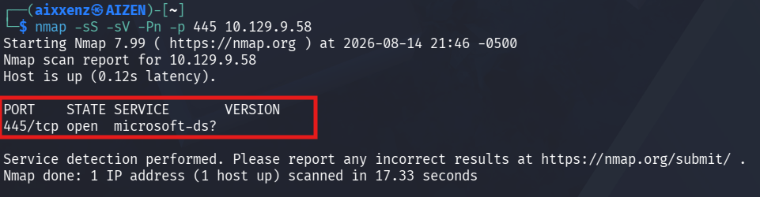
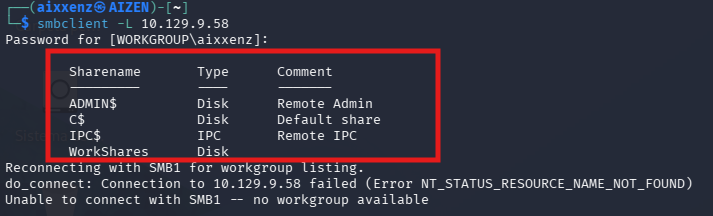
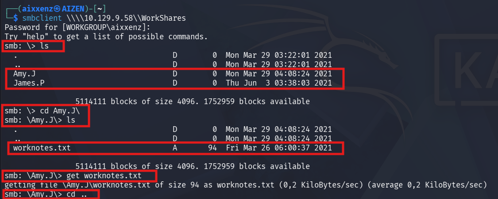
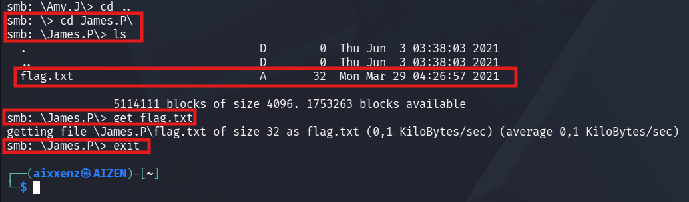
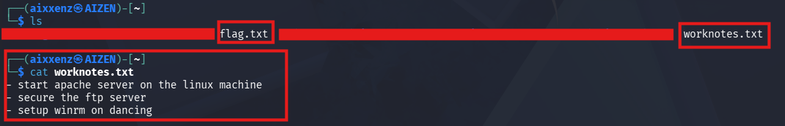
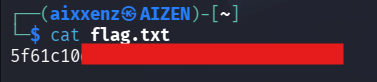

# Dancing
> **Dificultad:** Muy Fácil

> **IP:** 10.129.9.58

> **SO:** Linux

> **Habilidades puestas a prueba:**
> - Reconocimiento de servicios remotos
> - Explotación de acceso no autenticado
> - Navegación e interacción con consola Linux
> - Navegación e inspección en SMB

> **Hallazgos:** Protocolo SMB que permite listar los recursos compartidos y acceder sin credenciales válidas.

---

# Descripción

**Dancing** es una máquina Windows muy sencilla que introduce el protocolo Server Message Block **(SMB)**, su enumeración y su explotación cuando se configura mal para permitir el acceso sin contraseña.

---

# Herramientas utilizadas
- `Nmap` - Herramienta de escaneo de red empleada para la identificación de servicios en la máquina objetivo.
- `Cliente SMB` - Interacción directa con el puerto **445**.
- `Kali Linux` - Distribución utilizada como entorno de trabajo.

---

# Alcance y objetivos

Enumerar protocolo expuesto SMB y listar recursos compartidos sin credenciales válidas en busca del flag.txt

---

# Escaneo

Se realizó un escaneo de puertos hacia la IP objetivo identificando el puerto **445/TCP** abierto el cual corresponde al protocolo **SMB** con el servicio **microsoft-ds?**
```bash
nmap -sS -sV -Pn -p 445 10.129.9.58
```
# Output
```bash
PORT    STATE SERVICE      VERSION
445/tcp open  microsoft-ds?
```


# Desglose del comando:
1. `-sS ` **(SYN Scan):** Realiza un escaneo de sigilo (medio abierto) para determinar si el puerto está abierto sin completar el saludo de tres vías (Three-Way Handshake) de TCP. 
3. `-sV ` **(Version Detection):** Interroga al puerto para identificar la versión exacta del servicio activo.
4. `-Pn` **(No Ping):** Omite la prueba ICMP inicial y asume que el host está activo para evitar que un firewall bloquee el análisis.
5. `-p 445` **:** Restringe el escaneo únicamente al puerto objetivo para optimizar el tiempo de respuesta.


---

# Enumeración

Con el puerto 445/TCP abierto, se utilizó la herramienta smbclient para listar los recursos compartidos (shares) disponibles en el servidor remoto:

```bash
smbclient -L 10.129.9.58
```
# Recursos identificados:

- **ADMIN$ :** Recursos administrativos remotos (Acceso denegado).
- **c$ :** Recurso predeterminado de la unidad principal (Acceso denegado).
- **IPC$ :** Inter-Process Communication (Recurso de sistema) que no almacena archivos.
- **WorkShares :** Recurso compartido personalizado.
 


---
# Explotación

Una vez dentro de la sesión de SMB en el recurso WorkShares, se listó el contenido para identificar la estructura del directorio:

```bash
ls 
````
# Output
````bash
smb: \> ls
  Amy.J               D        0  Mon Mar 29 04:08:24 2021
  James.P             D        0  Thu Jun  3 03:38:03 2021
````

## 1. Inspección del directorio Amy.J
Se ingresó a la carpeta de Amy para verificar archivos de interés:

```` bash
cd Amy.J\
````
```` bash
ls
````
# Output
```` bash
smb: \> cd Amy.J\
smb: \Amy.J\> ls
  worknotes.txt       A       94  Fri Mar 26 06:00:37 2021
````
y se obtiene el archivo con el comando `get`.
````bash
get worknotes.txt
````

Posteriormente, se regresó al directorio raíz con `cd .. `
```` bash
cd ..
````


# 2. Inspección del directorio de James.P
Se navegó hacia el directorio de James donde se localizó la bandera:
````bash
cd James.P\
````
````bash
ls
````
# Output
````bash
smb: \> cd James.P\
smb: \James.P\> ls
  flag.txt            A       32  Mon Mar 29 04:26:57 2021
````
y se obtuvo la bandera con el comando `get`.
````bash
get flag.txt
````
Y por ultimo cerramos la sesion con el comando `exit`:
````bash
exit
````



---

# Analisis de evidencias:
Una vez descargados los archivos a la máquina local, se listaron e inspeccionaron sus contenidos y se leyó primero el archivo **worknotes.txt**.
````bash
$ ls
flag.txt  worknotes.txt

$ cat worknotes.txt
- start apache server on the linux machine
- secure the ftp server
- setup winrm on dancing
````


Después abrimos el archivo con el comando `cat flag.txt` y conseguiremos la bandera.
```` bash
cat flag.txt
````



### Flag: 5f61c10***************

---

# Lecciones aprendidas y recomendaciones

- **Restringir el acceso anónimo a recursos compartidos SMB:** Configurar las directivas de grupo (GPO) o los permisos de carpeta para evitar que usuarios no autenticados puedan conectarse o listar recursos del sistema.

- **Principio de mínimo privilegio:** Limitar los permisos de lectura sobre carpetas compartidas que contengan notas de trabajo o información interna sensible.

- **Auditoría de recursos compartidos:** Revisar periódicamente las carpetas expuestas vía SMB para eliminar aquellas que no sean estrictamente requeridas en la red.


---

# Conclusión
La solución de la máquina objetivo evidenció un riesgo directo asociado a la mala configuración del servicio SMB. Permitir la conexión anónima a recursos compartidos personalizados como **WorkShares** hizo posible que un atacante no autenticado pudiera explorar directorios internos, exfiltrar notas operativas y obtener la bandera **(flag.txt)**. Este tipo de hallazgos resalta la necesidad de aplicar controles de acceso estrictos y deshabilitar cuentas o accesos invitados por defecto en entornos corporativos.


